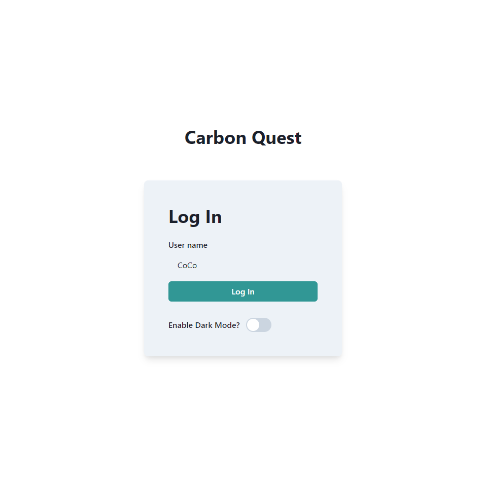
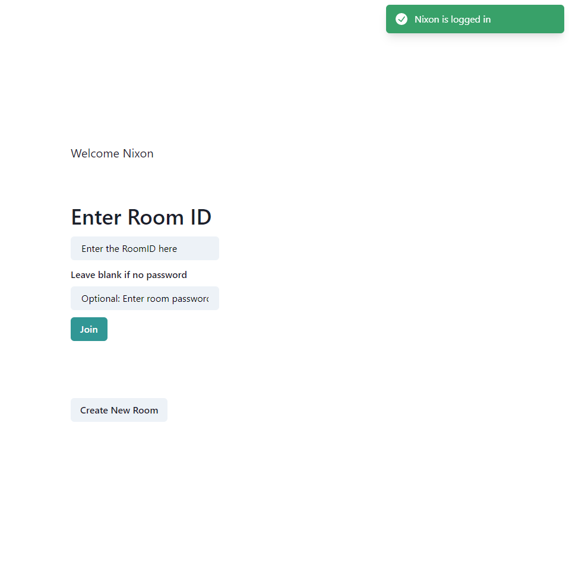
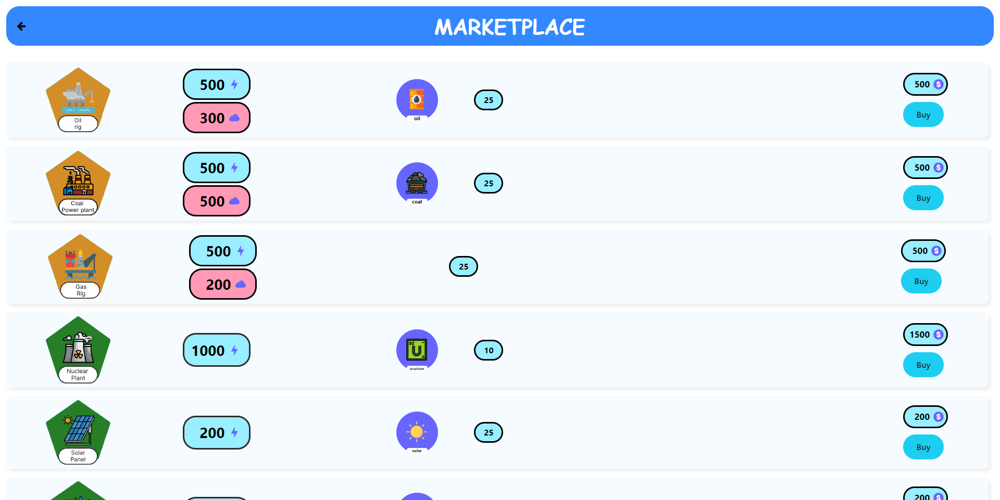
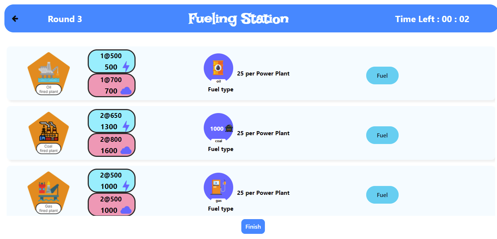
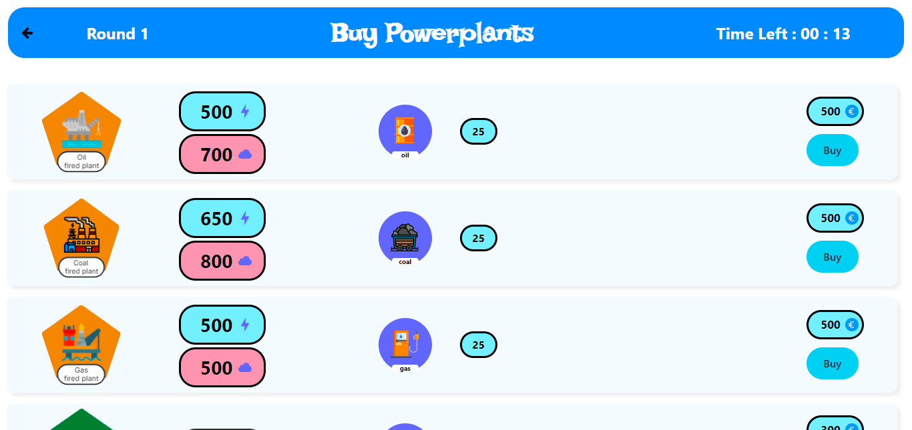

# Game Design

## Overview

**Carbon Quest** is a serious game targeted at adolescents aged 15–17.

It immerses players in a global scenario where they control a fictional country’s resources, finances, global trade, and energy production infrastructure.

The game is:
- **Round-based**: 3 rounds of 15 minutes each, with each round representing a year of in-game time.
- **Collaborative & multiplayer**: Players must work together while managing their own countries.
- **Educational**: Designed to teach about climate change, sustainability, and geopolitics.

## Core Gameplay

Players must:
- **Meet annual energy targets** or face penalties in the form of fines.
- **Trade** natural resources and wealth.
- **Build and fuel** power plants.
- **Strategically manage** energy sources to balance sustainability with productivity.

### Gameplay Screenshots

**Marketplace**

**Fueling Station**

**Power Plants Management**

## Key Metrics to Monitor

- Non-renewable energy reserves  
- Renewable energy capacity  
- Carbon emissions  
- National wealth  
- Total energy production  

## Game Loop & Win Condition

Despite carefully managing these factors, success is not guaranteed—players must make smart, adaptive decisions under time pressure.

The game concludes after the final round:
- Players are evaluated based on their total energy production.
- The country with the highest energy output is declared the **winner**.
- A post-game review allows reflection on strategies, successes, and failures.

---

> *Carbon Quest* aims to challenge players' decision-making skills while raising awareness of the complexities and trade-offs involved in global energy policy and climate action.

## Project Scope

**Carbon Quest** is a loose simulation of countries on the global stage trading among each other to acquire the resources needed to invest in and fuel various power plants. The primary objective is to reach national energy requirements within a defined time constraint.

This is **not** a high-fidelity simulation of real-world global trade. Instead, the game is designed to highlight elements of global trade that align with its educational goals and to introduce simplified principles of economics, such as:

- **Scarcity**
- **Supply and demand**
- **Costs and benefits**
- **Incentives**

### Design Constraints

Given the adolescent audience (15–17 years old) and the overwhelming complexity of real-world global trade, several constraints were intentionally applied:

#### 🔹 Simplified Economic Model
- The in-game economy is intentionally simplified to make it more accessible and educational.
- Resource availability is limited to demonstrate the principle of **supply and demand**.
- Players are encouraged to engage in **quick-fire verbal negotiations** and **custom trade agreements**.
- No additional economic actions (like resource extraction or supply chains) are implemented—these are **abstracted** or **implied**.

#### 🔹 Limited Resources and Power Plant Options
- To enhance focus and clarity, the game only includes a select number of **resources** and **power plant types**.
- All included elements are carefully chosen to support the game's **learning outcomes** and **strategic depth**.

#### 🔹 Reduced Realism for Educational Value
- **Game balance** and **educational clarity** are prioritized over strict realism.
- Some real-world complexities are deliberately omitted to avoid overwhelming players and to preserve the game's core learning experience.

---

> The goal is not to replicate real-world economics but to **engage young players** with energy strategy, cooperation, and resource management challenges in an accessible, game-based format.

## System Architecture

The diagram below represents a high-level overview of how the game's systems interact.

